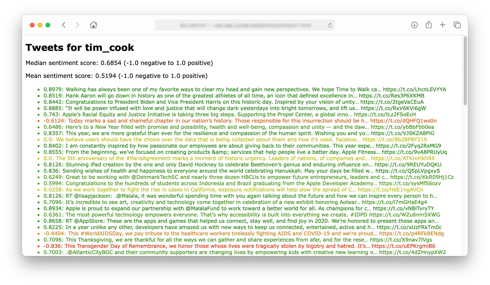

# Twitter Sentiment Service

This project aims to analyze text data from Twitter API with a sentiment model and deploys the model by building a web applicaton with `flask`, `gunicorn` and `nginx` on Oracle Cloud.

## Table of Content

1. [Environment set up](#1-environment-set-up)
    1. [Virtual Machine](#1-1-virtual-machine)
       1. [Firewall](#1-1-1-firewall)

    2. [Local computer](#1-2-local-computer)
    3. [Twitter API](#1-3-twitter-api)

2. [Docker settings](#2-docker-configurations)
   1. [Webserver](#2-1-web-server)
      1. [Flask](#2-1-1-flask)
      2. [Gunicorn](#2-1-2-gunicorn)
   2. [Nginx](#2-2-nginx)

3. [Usage](#3-usage)
   1. [Testing](#3-usage)
   2. [Debugging](#3-2-debugging)

## 1. Environment Set Up

If you would like to set up your service in the cloud, you can try to use always-free virtual machine on Oracle Cloud, and follow the relative settings under [1-1. Virtual Machine](#1-1-virtual-machine) section. However, if you want to run the service on your local computer, you can follow [1-2. Local Computer](#1-2-local-computer).

### 1-1. Virtual Machine

### 1-1-1. Firewall

The Ubuntu firewall is disabled by default, so it is necessary to update your iptables configuration to allow HTTP traffic. Enter `./update_firewall.sh` in the terminal. If the file is not executable, try `chmod +x update_firewall.sh`.

### 1-2 Local Computer

You should install `docker` and `docker-compose`. Execute `run_docker.sh` to run the whole services.

### 1-3. Twitter API

To use Twitter API, you have apply the authentication on website. Save the API keys and tokens in `./flask_app/tokens.txt`, and separate them with `, ` (comma and a space). To effectively use Twitter API in Python, you can install python package `tweepy` with `pip install tweepy`.

## 2. Docker Configurations

The service is composed of two dockers. One is `flask_app` which is the web server and the other is `nginx` which is the reversed proxy server. The configuration of `flask_app` is managed by `./flask_app/Dockerfile` and the configuration of `nginx` is in `./docker-compose.yml`.

### 2-1. Web Server

The web server is composed of `flask` and `gunicorn`.

#### 2-1-1. Flask
Build the web application.
#### 2-1-2. Gunicorn
Act as the multi-thread web server and the default address is `localhost:8000`. The configuration is at `./flask_app/config.py`.
### 2-2. Nginx
Act as the reverse proxy server and the address for `http` (port `80`) is `localhost:5050`.

**Note**: The configution is at `./nginx/default.conf`. Proxy passes for the web server `localhost:8000` and `http` listens port `80`. To avoid IP attack, map port `80` to port `5050` for external access.
## 3. Usage

Start the service with `./run_docker.sh`. Direct the browser to `http://<your-domain>:5050/sentiment/<twitter-screen-name>`.

### 3-1. Testing

After starting the docker, try `docker ps` to see if two dockers, `nginx` and `flask_app`, run successfully. Or execute `test_sentiment.sh` in `./flask_app/tests/sentiments`.  

### 3-2. Debugging

If testing failed, basically you will see docker `flask_app` keeps restarting with the command `docker ps`. Hence, just find out what's wrong in `flask_app`.

1. Stop the dockers first with the command `docker-compose rm -fs`.  
2. Go to folder `./flask_app` and run `python server.py tokens.txt`. Note: The port here might be `8000`.
3. Pay attention to the information it shows in terminal and carefully find out the bugs are.
